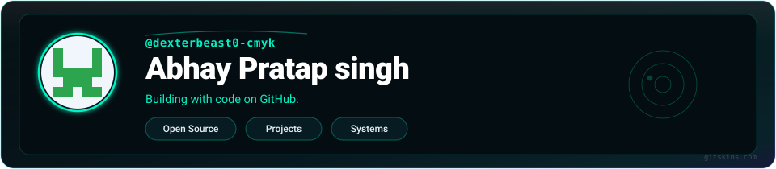
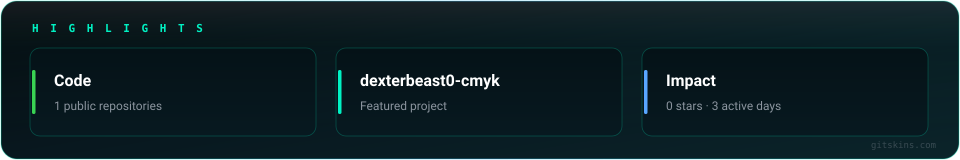
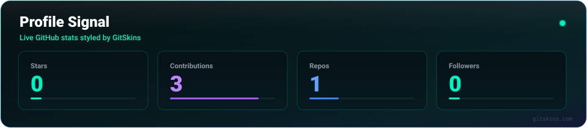
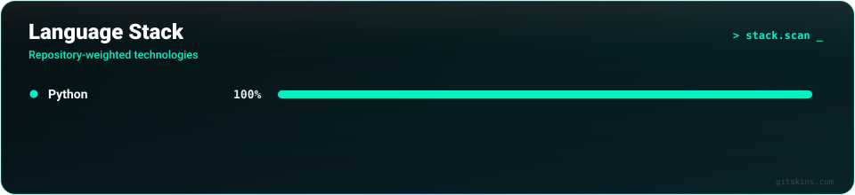
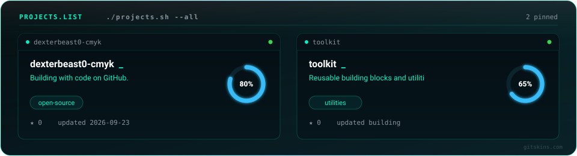
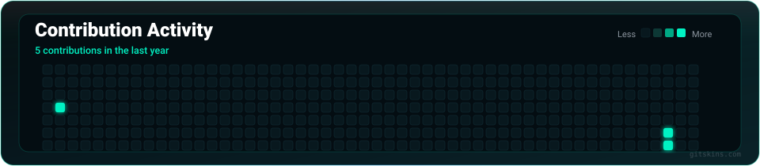
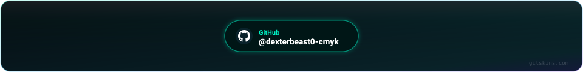

<!-- ============================================================ -->
<!-- 1. WORDMARK / IDENTITY TERMINAL                              -->
<!-- ============================================================ -->

  

<!-- ============================================================ -->
<!-- 2. HERO TERMINAL SCAN: VISUAL.MAP + SYSTEM.INFO              -->
<!-- ============================================================ -->

  

<!-- ============================================================ -->
<!-- 3. PROFILE IDENTITY CARD                                     -->
<!-- ============================================================ -->

  

<!-- ============================================================ -->
<!-- 4. GITHUB HIGHLIGHTS                                         -->
<!-- ============================================================ -->

  <a href="https://github.com/dexterbeast0-cmyk" style="text-decoration: none; color: #58a6ff; font-family: -apple-system, BlinkMacSystemFont, 'Segoe UI', Helvetica, Arial, sans-serif; font-size: 14px; font-weight: 500;">GitHub</a>

  

<!-- ============================================================ -->
<!-- 5. SIGNAL                                                    -->
<!-- ============================================================ -->
## Signal

  

  

<!-- ============================================================ -->
<!-- 6. WORK                                                      -->
<!-- ============================================================ -->
## Work

  

<!-- ============================================================ -->
<!-- 7. THE YEAR, SO FAR                                          -->
<!-- ============================================================ -->
## The year, so far

  

<!-- ============================================================ -->
<!-- 8. CONNECT / FOOTER                                          -->
<!-- ============================================================ -->

  

---

  Abhay Pratap singh · every panel is a single <code>&lt;img&gt;</code> of live GitHub data · built with GitSkins

